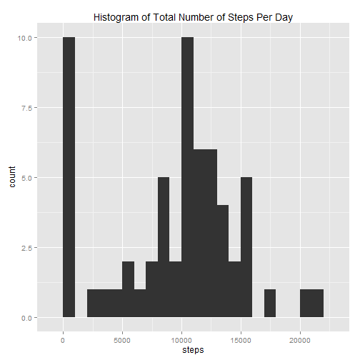
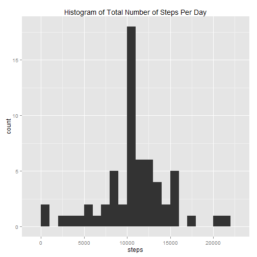
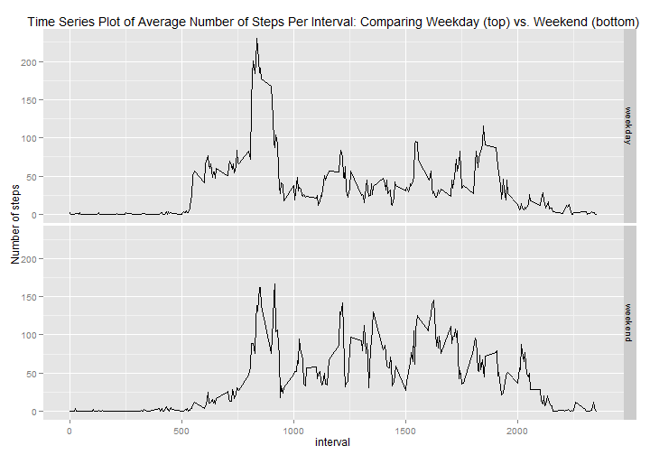

# Reproducible Research: Peer Assessment 1

## Loading and preprocessing the data

Reading the data after unzipped the data file "activity.zip".


```r
# read in the CSV file
activity <- read.csv("activity.csv")
```


Now, the answers to the questions.

## What is mean total number of steps taken per day?

-> Ignore the missing values in the dataset

-> Histogram of the total number of steps taken each day
-> Calculation of the mean and median total number taken each day.


```r
# create a data frame containing the sum of steps for each date
totalstepsperday <- data.frame(tapply(activity$steps, activity$date, sum, na.rm = TRUE))

names(totalstepsperday) <- "steps"

library(ggplot2)
```

```
## Warning: package 'ggplot2' was built under R version 3.1.1
```

```r
ggplot(totalstepsperday) + aes(x = steps) + geom_histogram(binwidth = 1000) + 
    labs(title = "Histogram of Total Number of Steps Per Day")
```

 

```r

# calculate the mean and median
mean(totalstepsperday$steps)
```

```
## [1] 9354
```

```r
median(totalstepsperday$steps)
```

```
## [1] 10395
```


-> We can notice tha the total number of steps per day is 9354 (mean), and the median total number of steps per day is 10395.

## What is the average daily activity pattern?

-> Time series plot of the average number of steps taken during each 5-minute interval


```r
# create a data frame
avgstepsperinterval <- data.frame(tapply(activity$steps, activity$interval, 
    mean, na.rm = TRUE))

names(avgstepsperinterval) <- "steps"

avgstepsperinterval$interval <- as.integer(row.names(avgstepsperinterval))

ggplot(avgstepsperinterval) + aes(x = interval, y = steps) + geom_line() + labs(title = "Time Series Plot of Average Number of Steps Per Interval")
```

 

```r

# determine which interval contains the maximum number of steps
names(which.max(avgstepsperinterval$steps))
```

```
## [1] "835"
```


-> The interval with the maximum number of steps is 835.

## Imputing missing values


```r
# calculate the number of missing values
sum(is.na(activity$steps))
```

```
## [1] 2304
```


-> There are 2304 missing values for "steps" in the dataset.

-> Here I create a new dataset (activity.missing) where I have imputed values (the mean for that 5-minute interval) for the missing values of "steps"


```r
# create the new dataset
activity.missing <- activity

# loop through each row in activity
for (i in 1:nrow(activity)) {
    # check if the 'steps' value is missing
    if (is.na(activity$steps[i])) {
        # if TRUE, replace the missing value with the mean for that interval
        activity.missing$steps[i] <- avgstepsperinterval$steps[which(avgstepsperinterval$interval == 
            activity$interval[i])]
    }
}
```


-> Histogram of the total number of steps taken each day, along with a calculation of the mean and median total number taken each day.


```r
# create a data frame containing the sum of steps for each date
totalstepsperday.imp <- data.frame(tapply(activity.missing$steps, activity.missing$date, 
    sum, na.rm = TRUE))

names(totalstepsperday.imp) <- "steps"

ggplot(totalstepsperday.imp) + aes(x = steps) + geom_histogram(binwidth = 1000) + 
    labs(title = "Histogram of Total Number of Steps Per Day")
```

 

```r

# calculate the mean and median total steps per day
mean(totalstepsperday.imp$steps)
```

```
## [1] 10766
```

```r
median(totalstepsperday.imp$steps)
```

```
## [1] 10766
```


-> For the new dataset, the mean and median total number of steps per day are both 10766. This is different from the first part of the assignment. 

## Are there differences in activity patterns between weekdays and weekends?

-> To answer this question, let's check for differences in activity patterns between weekdays and weekends.


```r
# The wday function from lubridate determines if each date is weekday or
# weekend
library(lubridate)
```

```
## Warning: package 'lubridate' was built under R version 3.1.1
```

```r
activity.missing$daytype <- as.factor(ifelse(wday(activity.missing$date, label = TRUE) %in% 
    c("Sat", "Sun"), "weekend", "weekday"))
```


-> Spliting the dataset by daytype.


```r
# split activity.missing by 'daytype'
s <- split(activity.missing, activity.missing$daytype)

# create data frames containing the mean number of steps for each interval
avgsteps.weekday <- data.frame(tapply(s$weekday$steps, s$weekday$interval, mean))
avgsteps.weekend <- data.frame(tapply(s$weekend$steps, s$weekend$interval, mean))

# fix the variable names
names(avgsteps.weekday) <- "steps"
names(avgsteps.weekend) <- "steps"

# add new variables for the interval
avgsteps.weekday$interval <- as.integer(row.names(avgsteps.weekday))
avgsteps.weekend$interval <- as.integer(row.names(avgsteps.weekend))

# add new variables for the daytype
avgsteps.weekday$daytype <- factor(rep("weekday", nrow(avgsteps.weekday)), levels = c("weekday", 
    "weekend"))
avgsteps.weekend$daytype <- factor(rep("weekend", nrow(avgsteps.weekend)), levels = c("weekday", 
    "weekend"))
```


-> Comparing the weekday and weekend datasets.


```r
# combine the weekday and weekend datasets
avgsteps.combined <- rbind(avgsteps.weekday, avgsteps.weekend)

ggplot(avgsteps.combined) + aes(x = interval, y = steps) + facet_grid(daytype ~ 
    .) + geom_line() + labs(title = "Time Series Plot of Average Number of Steps Per Interval: Comparing Weekday (top) vs. Weekend (bottom)", 
    y = "Number of steps")
```

 


-> As we can notice that there are differences in activity patterns between weekdays and weekends.
